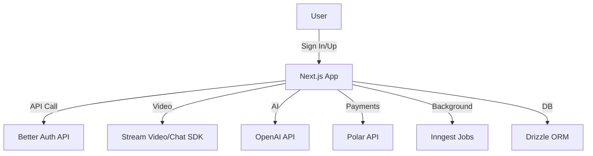
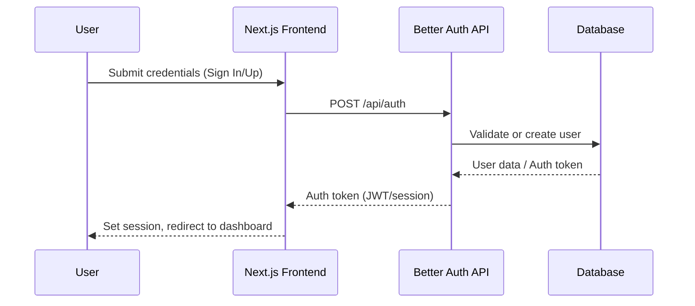

# Meet AI Platform 🚀

Next-generation video conferencing powered by AI: smarter, more productive, and effortlessly organized.

---

## 🌟 Features


| Core Functionality      | AI Capabilities         |
| ----------------------- | ----------------------- |
| AI-Powered Video Calls  | Custom Real-time Agents |
| Smart Meeting Summaries | AI Q&A                  |
| Meeting Recordings      | OpenAI Integration      |
| Transcript Search       | Smart Transcripts       |

---

## 🛠 Technical Stack

| Layer         | Technology                                    |
| ------------- | --------------------------------------------- |
| Frontend      | Next.js 16, React 19, Tailwind CSS v4         |
| UI Components | shadcn/ui                                     |
| Auth          | Better Auth                                   |
| Real-time     | Stream Video SDK, Stream Chat SDK             |
| Background    | Inngest (background jobs)                     |
| Payments      | Polar subscriptions                           |
| DB/ORM        | Drizzle ORM                                   |
| Package Mgmt  | Bun, npm, or yarn                             |
| Deploy        | Railway (via Docker image from GitHub Packages) |

---

## 📐 Architecture Overview



---

## 🔐 Authentication Flow



---

## 📦 Endpoints principales (API)

| Endpoint                      | Método | Descripción                      |
| ----------------------------- | ------ | -------------------------------- |
| `/api/auth/sign-in`           | POST   | Login de usuario                 |
| `/api/auth/sign-up`           | POST   | Registro de usuario              |
| `/api/meetings`               | GET    | Listar reuniones                 |
| `/api/meetings`               | POST   | Crear nueva reunión              |
| `/api/meetings/:id`           | GET    | Obtener detalles de reunión      |
| `/api/meetings/:id/summary`   | GET    | Obtener resumen AI de la reunión |
| `/api/meetings/:id/recording` | GET    | Descargar grabación              |
| `/api/payments/subscribe`     | POST   | Suscribirse vía Polar            |

---

## ⚙️ Variables de entorno

Configura tus variables en `.env.local` (para desarrollo local) y en Railway (para despliegue):

| Variable             | Descripción                          |
| -------------------- | ------------------------------------ |
| `STREAM_API_KEY`     | Credencial de Stream Video/Chat      |
| `STREAM_API_SECRET`  | Secreto de Stream Video/Chat         |
| `OPENAI_API_KEY`     | Clave de OpenAI                      |
| `BETTER_AUTH_SECRET` | Secreto para Better Auth             |
| `POLAR_API`          | Clave para pagos con Polar           |
| ...                  | Ver `.env.example` para más detalles |

---

## 🚀 Getting Started

### Prerequisitos

- Node.js 18+
- Bun (opcional, recomendado)
- npm o yarn
- Credenciales de Stream
- API Key de OpenAI

### Instalación

```bash
# Clona el repositorio
git clone https://github.com/LostoVayne/meet-ai-platform.git
cd meet-ai-platform

# Instala dependencias (elige uno)
bun install
# o
npm install
# o
yarn

# Configura variables de entorno
cp .env.example .env.local

# Inicia el servidor de desarrollo
bun dev
# o
npm run dev
# o
yarn dev
```

---

## 🚀 Deployment en Railway

Este proyecto se despliega en Railway utilizando una imagen Docker que se construye y se sube automáticamente a GitHub Packages mediante GitHub Actions.

### Flujo de Despliegue

1.  **Push a la rama `master`**: Al hacer `git push` a la rama `master`, se activa un workflow de GitHub Actions (`.github/workflows/deploy.yml`).
2.  **Construcción y Push de la Imagen Docker**: El workflow construye la imagen Docker utilizando `dockerfile.prod` y la sube a GitHub Packages (`ghcr.io`).
3.  **Despliegue en Railway**: Railway detecta la nueva imagen en GitHub Packages y automáticamente despliega la nueva versión de la aplicación.

### Configuración en Railway

1.  **Conecta tu repositorio**: En Railway, crea un nuevo proyecto y conecta tu repositorio de GitHub.
2.  **Configura el servicio**: 
    *   Selecciona la opción para desplegar desde una **imagen Docker**.
    *   Especifica la URL de la imagen de GitHub Packages. Por ejemplo: `ghcr.io/LostoVayne/meet-ai-platform:latest` (asegúrate de reemplazar `LostoVayne` con tu nombre de usuario de GitHub y `meet-ai-platform` con el nombre de tu repositorio).
    *   Asegúrate de que Railway tenga los permisos necesarios para acceder a tus GitHub Packages.
3.  **Variables de Entorno**: Configura todas las variables de entorno necesarias (las mismas que en `.env.local`) directamente en la configuración de tu servicio en Railway.

---

## 🧩 Uso de shadcn/ui

- Componentes reutilizables en `src/components/ui/`.
- Ejemplo:

```tsx
import { Button } from "@/components/ui/button";

<Button variant="primary">Iniciar reunión</Button>;
```

---

## 🔑 Better Auth

- Autenticación segura y moderna.
- Flujos en `src/app/(auth)/sign-in` y `sign-up`.
- Vistas personalizadas en `src/modules/auth/ui/views/`.

---

## 💳 Polar (Pagos y Suscripciones)

- Integración con Polar para suscripciones y pagos.
- Configura tu clave en las variables de entorno.
- El flujo de pago se maneja desde el dashboard.

---

## 📚 Reglas y buenas prácticas

- Usa **Bun** para desarrollo rápido y eficiente.
- Sigue la convención de carpetas de Next.js (app router).
- Componentes UI en `src/components/ui/`.
- Hooks personalizados en `src/hooks/`.
- Mantén dependencias actualizadas.
- Usa ESLint y Prettier para mantener el código limpio.
- No subas claves ni secretos al repositorio.

---

## 🧪 Testing

- Próximamente: integración con Jest y pruebas E2E.

---

## 🤝 Contribuir

1. Haz un fork del repositorio.
2. Crea una rama para tu feature/fix.
3. Haz un PR describiendo tus cambios.

---

## 📞 Soporte

¿Dudas o sugerencias? Abre un issue o contacta a [Lostovayne](https://github.com/LostoVayne).

---

## 📝 Licencia

Este proyecto está bajo la Licencia MIT. Consulta el archivo [LICENSE](./LICENSE) para más detalles.